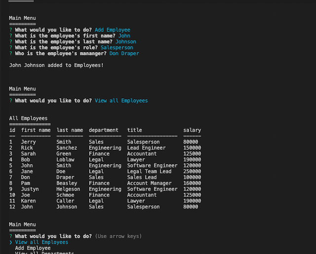

  # Employee Tracker

  


  ## Description
  
  In this applicaiton, the user buildings an employee database by adding employees, adding roles, and adding departments. The application also allows you to view all employees, all departments, and and all roles. All of this is done on the command line in the terminal.

  ## Table of Contents


  -- [Installation](#Installation)

  -- [Usage](#Usage)

  -- [License](#License)


  ## Installation


  The user should clone this repository from GitHub. They should have node downloaded onto thier machine. 
  
  In order to use the application, the user must install [Inquirer](https://www.npmjs.com/package/inquirer), [mysql2](https://www.npmjs.com/package/mysql2), [console.table](https://www.npmjs.com/package/console.table), and [figlet](https://www.npmjs.com/package/figlet).
  ```sh
  npm i inquirer mysql2 console.table figlet
  ```

  ## Usage

  
  
  

  ## License


  (https://opensource.org/licenses/MIT)

  This application is licensed under The MIT License


  ## Questions


  [GitHub](https:github.com/jystyn)

  [E-Mail](mailto:justyn.helgeson@gmail.com)

